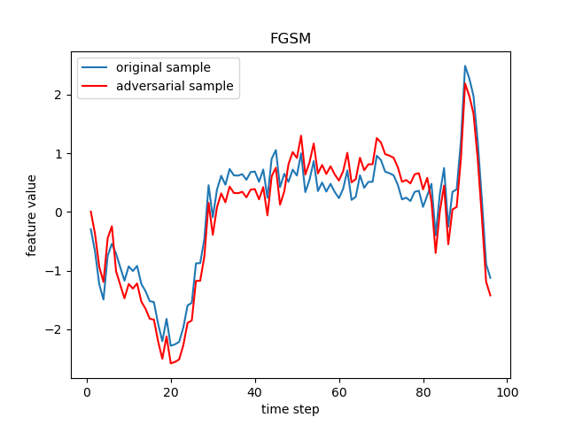
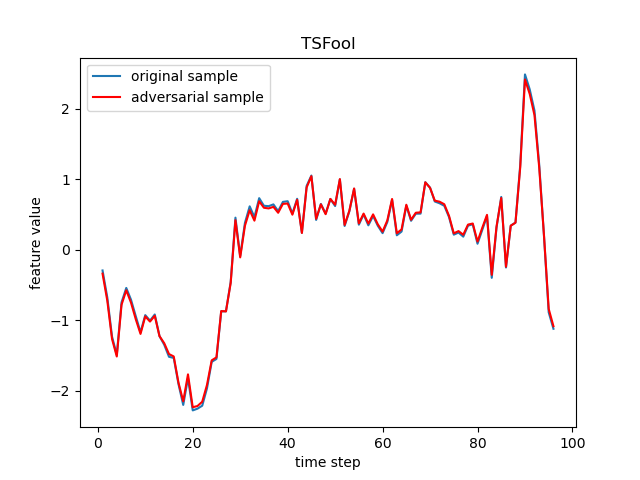

# TSFool

**TSFool is a multi-objective gray-box attack method to craft highly-imperceptible adversarial samples for RNN-based time series classification. The TSFool method in this repository is built for univariate time series data, and an extended version called Multi-TSFool for multivariate time series data can be found [here](https://github.com/FlaAI/Multi-TSFool).**

- The **pre-trained RNN classifiers** used in our experiments are available [here](https://github.com/FlaAI/TSFool/tree/main/models).
- The **adversarial sets generated by TSFool** are available [here](https://github.com/FlaAI/TSFool/tree/main/datasets/adversarial), and their information are provided [here](#jump2).
- The **detailed experiment records** can be found [here](#jump).
- The additional experimental results for **the impact of different hyper-parameter settings** can be found [here](https://github.com/FlaAI/TSFool/blob/main/figures/Impact%20of%20Hyper-parameters.pdf). 

<h4 align='center'> A Comparison Between [TSFOOL] and [FIVE COMMON ADVERSARIAL ATTACKS] on UCR-ECG200 Dataset </h4>





# Quick Start
<!-- ### under construction now :) -->

### Prerequisites
- [torch](https://pytorch.org/)
- [numpy](https://numpy.org/)
- [matplotlib](https://matplotlib.org/)


### Get & Run
```cmd
$ git clone https://github.com/FlaAI/TSFool.git
$ cd TSFool
$ python
  >>> # load your target model and dataset #
  >>> from main import TSFool
  >>> adv_X, target_Y, target_X = TSFool(model, X, Y)
```

### Function
```python
adv_X, target_Y, target_X = TSFool(model, X, Y, K=2, T=30, F=0.1, eps=0.01, N=20, P=0.9, C=1, target=-1, details=False)
```
Given a target time series dataset ```(X, Y)``` and the corresponding RNN classifier ```model```, TSFool can automatically capture potential vulnerable samples to craft highly-imperceptible adversarial perturbation, and finally output a generated adversarial set ```adv_X```, as well as the captured original samples ```target_X``` and their labels ```target_Y```. 

Empirically, we provide default values of all the hyper-parameters used, while of course you can adjust them according to specific practices to achieve better performance. Below is some information that may be found useful:

The hyper-parameters ```K, T, F``` are introduced for the establishment of a representation model used in TSFool named *intervalized weighted finite automaton (i-WFA)*. Specifically, ```K, T``` come from the original WFA model, so for the adjustment of their value, we recommend the paper "[Decision-guided weighted automata extraction from recurrent neural networks](https://ojs.aaai.org/index.php/AAAI/article/view/17391)" where WFA is proposed for more details. On the other hand, ```F``` is introduced by us to determine the size of domain interval for the input abstraction in the establishment of i-WFA. The larger the value of ```F```, the finer-grained the interval, which leads to the more precise input abstraction but weaker generalization for unseen data.

The hyper-parameters ```eps, N, P, C``` are used to control the crafting of adversarial samples, respectively for the perturbation amount, the number of adversarial samples generated from every single pair of vulnerable sample and target sample, the possibility of a random masking noise used, and the number of target sample matched for every specific vulnerable sample. Notice that the larger the value of ```P```, the less the randomness of masking noise, which means the higher attack success rate but the more similar adversarial samples generated from the same pair of vulnerable sample and target sample. The TSFool support both targeted and untargeted attack, and the ```target``` is provided for specifying your target label.

If you are interested in the detailed attack process of TSFool, please value ```details``` to be *True* to print more run-time information.


### Arguments
- **model** (*[nn.Module](https://pytorch.org/docs/stable/generated/torch.nn.Module)*): the target rnn classifier
- **X** (*[numpy.array](https://numpy.org/doc/stable/reference/generated/numpy.array)*): time series sample (sample_amount, time_step, feature_dim)
- **Y** (*[numpy.array](https://numpy.org/doc/stable/reference/generated/numpy.array)*): label (sample_amount, )
- **K** (*int*): >=1, hyper-parameter of build_WFA(), denotes the number of K-top prediction scores to be considered
- **T** (*int*): >=1, hyper-parameter of build_WFA(), denotes the number of partitions of the prediction scores
- **F** (*float*): (0, 1], hyper-parameter of build_WFA(), ensures that comparing with the average distance between feature points, the grading size of tokens are micro enough
- **eps** (*float*): (0, 0.1], hyper-parameter for perturbation, denotes the perturbation amount under the limitation of 'micro' (value 0.1 corresponds to the largest legal perturbation amount)
- **N** (*int*): >=1, hyper-parameter for perturbation, denotes the number of adversarial samples generated from a specific minimum positive sample
- **P** (*float*): (0, 1], hyper-parameter for perturbation, denotes the possibility of the random mask
- **C** (*int*): >=1, hyper-parameter for perturbation, denotes the number of minimum positive samples to be considered for each of the sensitive negative samples
- **target** (*int*): [-1, max label], hyper-parameter for perturbation, -1 denotes untargeted attack, other values denote targeted attack with the corresponding label as the target
- **details** (*bool*): if True, print the details of the attack process


<!-- ## Update
#### February 2023:
- A new version of TSFool implemented as a Python module is available now.
- The corresponding information would be updated soon (expected to complete before Feb. 9, AOE time).
#### September 2022:
- ~~The raw experiment records about **1) the datasets selected from the UCR archive**, **2) the target LSTM classifiers**, **3) the intervalized weighted finite automatons established in the process**, and **4) the results of the final adversarial attacks** have been opened.~~
- ~~The **experiment code**, the **pre-trained models** and the **crafted adversarial sets** are respectively uploaded in the ``Programs``, ``Models`` and ``UCR-Adv`` for reproducibility as well as to allow verification and possible improvement.~~
#### July 2022:
- ~~The sample program using TSFool to craft adversarial time series for an LSTM classifier in PowerCons Dataset from UCR Archive is added for reference in advance.~~
- ~~The work is in progress at present and the detailed description (as well as a possible technology paper) will be opened to the public soon.~~
 -->

# Core Idea

A possible explanation for the existence of the adversarial sample is that, the features of input data cannot always fully and visually reflect the latent manifold, which makes it possible for the samples considered to be similar in features to have dramatically different latent manifolds. As a consequence, even a small perturbation in human cognition added to a correctly predicted sample may completely change the perception of NN to its latent manifold, and result in a significantly different prediction result.

So if there is a kind of representation model that can imitate the mechanism of a specific NN classifier to predict input data, but distinguish different inputs by their features in the original high-dimensional space just like a human, then it can be introduced to capture the otherness between the latent manifold and features of specific vulnerable samples. And such otherness can serve as an effective guide for the crafting of perturbation in adversarial attack. This idea can be especially useful when white-box knowledge like model gradients are not available, and its advantage in the imperceptibility can be significantly revealed by the attack on some types of data that are sensitive to perturbation in particular (as the RNN model + time series data we focus on here).


# <span id="jump"></span> Detailed Experiment Records

## The 10 Experimental Datasets from UCR Archive

**The UCR Time Series Classification Archive:** https://www.cs.ucr.edu/~eamonn/time_series_data_2018/

We select the 10 experimental datasets following the *UCR briefing document* strictly to make sure there is no cherry-picking. To be specific, the claims for the data are:
- 30 $\leq$ Train Size $\leq$ 1000, since the pre-training of RNN classifiers is not a main part of our approach and is not expected to spend too much time, while a too-small training set may make the model learning unnecessarily challenging, and a too-big training set is more likely to be time-consuming respectively;
- Test Size $\leq$ 4000, since all the attack methods are based on the test set to craft adversarial samples and we expect to compare them efficiently; and
- class numbers $\leq$ 5 and time step length $\leq$ 150, since they represent the scale of the original problem which we also would like to reduce due to the same reason as above.

Note that all the claims are proposed just for a compromise between general significance and experimental efficiency of our evaluation (since hopefully this would be suitable for reporting in a technology paper), instead of an inherent limitation of TSFool. Just as the "best practice" suggested by the *UCR briefing document*, we will gradually test and publish the results of TSFool attack on all the rest UCR datasets in the future.

| ID     | Type      | Name                           | Train | Test | Class | Length |
|--------|-----------|--------------------------------|-------|------|-------|--------|
| CBF    | Simulated | CBF                            | 30    | 900  | 3     | 128    |
| DPOAG  | Image     | DistalPhalanxOutlineAgeGroup   | 400   | 139  | 3     | 80     |
| DPOC   | Image     | DistalPhalanxOutlineCorrect    | 600   | 276  | 2     | 80     |
| ECG200 | ECG       | ECG200                         | 100   | 100  | 2     | 96     |
| GP     | Motion    | GunPoint                       | 50    | 150  | 2     | 150    |
| IPD    | Sensor    | ItalyPowerDemand               | 67    | 1029 | 2     | 24     |
| MPOAG  | Image     | MiddlePhalanxOutlineAgeGroup   | 400   | 154  | 3     | 80     |
| MPOC   | Image     | MiddlePhalanxOutlineCorrect    | 600   | 291  | 2     | 80     |
| PPOAG  | Image     | ProximalPhalanxOutlineAgeGroup | 400   | 205  | 3     | 80     |
| PPOC   | Image     | ProximalPhalanxOutlineCorrect  | 600   | 291  | 2     | 80     |


## The Comparison of TSFool and Five Common Adversarial Attacks on the Experimental Datasets

There are five existing adversarial attacks adopted as benchmarks in our evaluation.

The **FGSM**, **BIM**, **DeepFool** and **PGD** are commonly used basic or state-of-the-art benchmarks respectively from the following papers:
- FGSM: [Explaining and harnessing adversarial examples](https://arxiv.org/abs/1412.6572)
- BIM: [Adversarial Examples in the Physical World](https://arxiv.org/abs/1607.02533)
- DeepFool: [DeepFool: A Simple and Accurate Method to Fool Deep Neural Networks](https://arxiv.org/abs/1511.04599)
- PGD: [Towards Deep Learning Models Resistant to Adversarial Attacks](https://arxiv.org/abs/1706.06083)

Our implementation of these attacks is based on **Torchattacks** (3.2.6):
```python
FGSM_attack = torchattacks.FGSM(model, eps=8/255)
BIM_attack = torchattacks.BIM(model, eps=8/255, alpha=2/255, steps=10)
DeepFool_attack = torchattacks.DeepFool(model, steps=50, overshoot=0.02)
PGD_attack = torchattacks.PGD(model, eps=8/255, alpha=1/255, steps=10, random_start=True)
```
- Paper: [Torchattacks: A pytorch repository for adversarial attacks](https://arxiv.org/abs/2010.01950)
- Resource: https://adversarial-attacks-pytorch.readthedocs.io/en/latest/index.html

On the other hand, for the **transfer attack**, a public adversarial UCR set (generated by ResNet + BIM) is used: 
- Paper: [Adversarial Attacks on Deep Neural Networks for Time Series Classification](https://arxiv.org/abs/1903.07054)
- Resource: https://germain-forestier.info/src/ijcnn2019

Notice that the results below are acquired under the default hyper-parameter setting of all the experimental methods. For the impact of different hyper-parameter settings, please see additional experiments [here](https://github.com/FlaAI/TSFool/blob/main/figures/Impact%20of%20Hyper-parameters.pdf). In short, the results under default setting are representative and of general significance. 

<span id="jump2"></span>

### Exp. 1
- **Dataset: CBF**
- **Original Model Acc (Test Set): 0.7511**
- **Adversarial Set Generated by TSFool: [ADV-CBF](https://github.com/FlaAI/TSFool/tree/main/datasets/adversarial/CBF)**

| Method          | Attacked Acc | Generate Num | Time Cost (s) | Perturbation | CC         |
|-----------------|--------------|--------------|---------------|--------------|------------|
| FGSM            | 0.3311       | 900          | **0.004389**  | 14.12%       | 1.1481     |
| BIM             | 0.7022       | 900          | 0.029421      | 3.17%        | 0.9916     |
| DeepFool        | 0.2911       | 900          | 3.298845      | 12.29%       | 1.0994     |
| PGD             | 0.3311       | 900          | 0.029949      | 14.28%       | 1.1492     |
| Transfer Attack | 0.7422       | 900          | -             | **2.60%**    | 1.0105     |
| TSFool          | **0.2111**   | 720          | 0.042502      | 7.48%        | **0.7425** |


### Exp. 2
- **Dataset: DPOAG**
- **Original Model Acc (Test Set): 0.7842**
- **Adversarial Set Generated by TSFool: [ADV-DPOAG](https://github.com/FlaAI/TSFool/tree/main/datasets/adversarial/DistalPhalanxOutlineAgeGroup)**

| Method          | Attacked Acc | Generate Num | Time Cost (s) | Perturbation | CC         |
|-----------------|--------------|--------------|---------------|--------------|------------|
| FGSM            | 0.4245       | 139          | **0.003190**  | 64.20%       | 1.1593     |
| BIM             | 0.7554       | 139          | 0.028328      | 13.59%       | 1.1577     |
| DeepFool        | 0.1727       | 139          | 0.961403      | 50.61%       | **1.1297** |
| PGD             | 0.3525       | 139          | 0.029060      | 64.68%       | 1.1660     |
| Transfer Attack | 0.8575       | 400          | -             | 9.62%        | 1.8219     |
| TSFool          | **0.1071**   | 140          | 0.036396      | **4.93%**    | 1.6093     |


### Exp. 3
- **Dataset: DPOC**
- **Original Model Acc (Test Set): 0.7319**
- **Adversarial Set Generated by TSFool: [ADV-DPOC](https://github.com/FlaAI/TSFool/tree/main/datasets/adversarial/DistalPhalanxOutlineCorrect)**

| Method          | Attacked Acc | Generate Num | Time Cost (s) | Perturbation | CC         |
|-----------------|--------------|--------------|---------------|--------------|------------|
| FGSM            | 0.5833       | 276          | **0.002116**  | 42.21%       | **0.7966** |
| BIM             | 0.6413       | 276          | 0.022393      | 8.84%        | 0.9383     |
| DeepFool        | 0.4420       | 276          | 1.974539      | 38.69%       | 0.9372     |
| PGD             | 0.5833       | 276          | 0.023130      | 42.54%       | 0.7967     |
| Transfer Attack | 0.6767       | 600          | -             | 5.24%        | 1.0938     |
| TSFool          | **0.0652**   | 660          | 0.011313      | **2.93%**    | 0.8381     |


### Exp. 4
- **Dataset: ECG200**
- **Original Model Acc (Test Set): 0.7400**
- **Adversarial Set Generated by TSFool: [ADV-ECG200](https://github.com/FlaAI/TSFool/tree/main/datasets/adversarial/ECG200)**

| Method          | Attacked Acc | Generate Num | Time Cost (s) | Perturbation | CC         |
|-----------------|--------------|--------------|---------------|--------------|------------|
| FGSM            | 0.5800       | 100          | **0.003786**  | 21.07%       | 1.2930     |
| BIM             | 0.6500       | 100          | 0.035593      | **4.10%**    | 0.9787     |
| DeepFool        | **0.0200**   | 100          | 0.242110      | 17.35%       | 1.2834     |
| PGD             | 0.5200       | 100          | 0.037794      | 21.51%       | 1.3359     |
| Transfer Attack | 0.7300       | 100          | -             | 4.26%        | 1.0422     |
| TSFool          | 0.0571       | 140          | 0.019018      | 4.41%        | **0.6291** |


### Exp. 5
- **Dataset: GP**
- **Original Model Acc (Test Set): 0.9333**
- **Adversarial Set Generated by TSFool: [ADV-GP](https://github.com/FlaAI/TSFool/tree/main/datasets/adversarial/GunPoint)**

| Method          | Attacked Acc | Generate Num | Time Cost (s) | Perturbation | CC         |
|-----------------|--------------|--------------|---------------|--------------|------------|
| FGSM            | 0.4933       | 150          | **0.005317**  | 37.25%       | 1.8911     |
| BIM             | 0.9133       | 150          | 0.055787      | 8.61%        | 0.8701     |
| DeepFool        | 0.4467       | 150          | 4.224587      | 39.10%       | 1.7623     |
| PGD             | 0.4933       | 150          | 0.058562      | 37.50%       | 1.8903     |
| Transfer Attack | 0.9133       | 150          | -             | 5.06%        | 0.7851     |
| TSFool          | **0.0000**   | 80           | 0.193720      | **3.11%**    | **0.6815** |


### Exp. 6
- **Dataset: IPD**
- **Original Model Acc (Test Set): 0.9650**
- **Adversarial Set Generated by TSFool: [ADV-IPD](https://github.com/FlaAI/TSFool/tree/main/datasets/adversarial/ItalyPowerDemand)**

| Method          | Attacked Acc | Generate Num | Time Cost (s) | Perturbation | CC         |
|-----------------|--------------|--------------|---------------|--------------|------------|
| FGSM            | 0.8571       | 1029         | **0.000281**  | 24.20%       | 0.9330     |
| BIM             | 0.9368       | 1029         | 0.055788      | 3.90%        | 1.2255     |
| DeepFool        | **0.1535**   | 1029         | 0.094490      | 30.56%       | 1.1140     |
| PGD             | 0.8192       | 1029         | 0.002599      | 24.59%       | 0.8952     |
| Transfer Attack | 0.9320       | 1029         | -             | 4.98%        | 1.0780     |
| TSFool          | 0.1588       | 340          | 0.008746      | **2.98%**    | **0.8021** |


### Exp. 7
- **Dataset: MPOAG**
- **Original Model Acc (Test Set): 0.6429**
- **Adversarial Set Generated by TSFool: [ADV-MPOAG](https://github.com/FlaAI/TSFool/tree/main/datasets/adversarial/MiddlePhalanxOutlineAgeGroup)**

| Method          | Attacked Acc | Generate Num | Time Cost (s) | Perturbation | CC         |
|-----------------|--------------|--------------|---------------|--------------|------------|
| FGSM            | 0.1883       | 154          | **0.006101**  | 123.79%      | 1.2606     |
| BIM             | 0.5519       | 154          | 0.055789      | 26.86%       | 1.0486     |
| DeepFool        | **0.0130**   | 154          | 0.261087      | 80.59%       | 1.2047     |
| PGD             | 0.1883       | 154          | 0.061951      | 124.59%      | 1.2593     |
| Transfer Attack | 0.7925       | 400          | -             | 9.46%        | 1.4861     |
| TSFool          | 0.0333       | 60           | 0.095760      | **5.72%**    | **0.6831** |


### Exp. 8
- **Dataset: MPOC**
- **Original Model Acc (Test Set): 0.6392**
- **Adversarial Set Generated by TSFool: [ADV-MPOC](https://github.com/FlaAI/TSFool/tree/main/datasets/adversarial/MiddlePhalanxOutlineCorrect)**

| Method          | Attacked Acc | Generate Num | Time Cost (s) | Perturbation | CC         |
|-----------------|--------------|--------------|---------------|--------------|------------|
| FGSM            | 0.5704       | 291          | **0.002051**  | 100.93%      | 1.0111     |
| BIM             | 0.6392       | 291          | 0.055790      | 21.82%       | 0.9903     |
| DeepFool        | 0.5361       | 291          | 2.326599      | 106.93%      | 0.9718     |
| PGD             | 0.5704       | 291          | 0.022377      | 101.61%      | 1.0123     |
| Transfer Attack | 0.4833       | 600          | -             | 9.35%        | 1.0294     |
| TSFool          | **0.1425**   | 400          | 0.018027      | **5.46%**    | **0.7291** |


### Exp. 9
- **Dataset: PPOAG**
- **Original Model Acc (Test Set): 0.8976**
- **Adversarial Set Generated by TSFool: [ADV-PPOAG](https://github.com/FlaAI/TSFool/tree/main/datasets/adversarial/ProximalPhalanxOutlineAgeGroup)**

| Method          | Attacked Acc | Generate Num | Time Cost (s) | Perturbation | CC         |
|-----------------|--------------|--------------|---------------|--------------|------------|
| FGSM            | 0.4878       | 205          | **0.002640**  | 134.01%      | **0.7961** |
| BIM             | 0.8878       | 205          | 0.055791      | 30.79%       | 1.5299     |
| DeepFool        | 0.1902       | 205          | 2.265096      | 121.79%      | 1.1564     |
| PGD             | 0.4878       | 205          | 0.027445      | 134.95%      | 0.7991     |
| Transfer Attack | 0.8829       | 205          | -             | 16.46%       | 1.6559     |
| TSFool          | **0.0643**   | 140          | 0.054581      | **15.74%**   | 0.8990     |


### Exp. 10
- **Dataset: PPOC**
- **Original Model Acc (Test Set): 0.7869**
- **Adversarial Set Generated by TSFool: [ADV-PPOC](https://github.com/FlaAI/TSFool/tree/main/datasets/adversarial/ProximalPhalanxOutlineCorrect)**

| Method          | Attacked Acc | Generate Num | Time Cost (s) | Perturbation | CC         |
|-----------------|--------------|--------------|---------------|--------------|------------|
| FGSM            | 0.6838       | 291          | **0.002175**  | 119.19%      | 1.7029     |
| BIM             | 0.7320       | 291          | 0.055792      | 26.98%       | 1.0942     |
| DeepFool        | 0.3746       | 291          | 2.314018      | 96.88%       | **1.0729** |
| PGD             | 0.6838       | 291          | 0.024215      | 120.02%      | 1.7022     |
| Transfer Attack | 0.8419       | 291          | -             | 13.48%       | 1.2120     |
| TSFool          | **0.1537**   | 540          | 0.015317      | **2.40%**    | 1.1282     |


<h4 align='center'> Comparison of Classification Accuracy before and after TSFool and the benchmark attacks </h1>


<!-- ## The Experimental LSTM Classifiers -->

